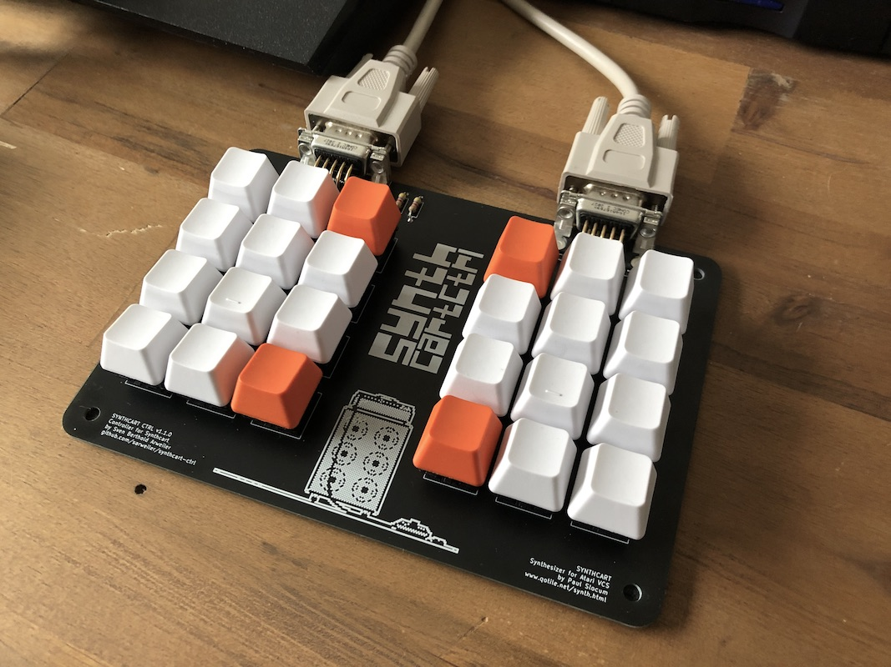

# Synthcart Ctrl

Synthcart Ctrl is a controller for the Atari 2600 synthesizer [Synthcart](http://www.qotile.net/synth.html) by Paul Slocum. It's basically two Atari keyboard controller circuits on a single PCB.

## Building Synthcart Ctrl

Building a Synthcart Ctrl is a very easy and beginner-friendly soldering project.

### PCB

Upload the Gerber files in the [kicad](kicad) directory (you may want to zip the whole `gerbers` directory for easier handling) to a PCB manufacturer of your choice and order a PCB.

### Parts

* Four 4.7kOhm resistors.
* 24 Cherry MX switches of your choice, preferably of the PCB-mount variant (with fixation pins, [these, for example](https://www.mouser.com/ProductDetail/540-MX1A-11NW)). Non-PCB-mount switches (frame mount, without fixation pins) will work, too, but you will have to be careful to align them correctly when soldering.
* Two female DB9 connectors of the PCB-mount variant with mounting pins ([these](https://www.mouser.com/ProductDetail/571-2311765-1), [these](https://www.reichelt.de/d-sub-buchse-9-polig-gewinkelt-rm-9-4-gedr-d-sub-bu-09gwc-p113921.html), or any connector with similar measurements will work).
* 24 Cherry MX compatible keycaps of your choice. (I used [these](https://www.aliexpress.com/item/32987364794.html?spm=a2g0s.9042311.0.0.27424c4dBs286T) in the "blank" variant.)
* Two DB9 extension cables for connecting the controller to the Atari.
* Optional: 4 rubber feet

### Soldering

* Start by soldering the four resistors (R1, R2, R3, R4).
* Solder the two female DB9 connectors (J1, J2).
* Solder all 24 Cherry MX switches. If you're using non-PCB-mount switches be careful to align them correctly.
* Install your keycaps on the switches.
* Add some rubber feet to the bottom of the PCB, if you like.
* Done!

## Using Synthcart Ctrl

Using the controller is pretty straight forward: Connect the left port of your controller to the left joystick port on the Atari and the right port to the right joystick port on the Atari using two DB9 extension cables.

Use the two sides of the controller like you would use two Atari keyboard controllers to control Synthcart.

For information on how to use Synthcart, check out the [Synthcart](http://www.qotile.net/synth.html) manual.

